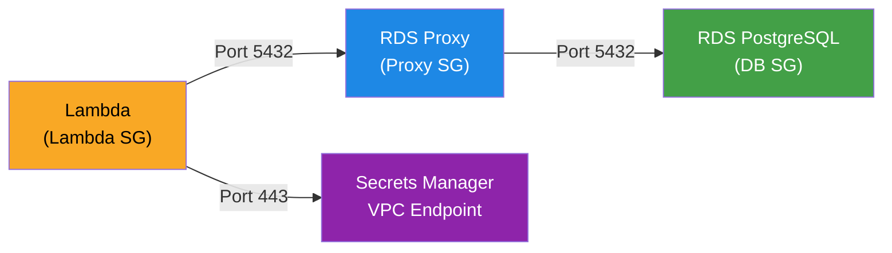

# Integrate AWS RDS PostgreSQL (db.t4g.micro) + RDS Proxy into Advitiyans

Replace the current in-memory mock data store with real PostgreSQL queries routed through **AWS RDS Proxy** for connection pooling, IAM auth, and failover resilience.

---

## Architecture Overview

```
Frontend (S3/CloudFront)
    │
    ▼
API Gateway → Lambda (in VPC)
                  │
                  ▼
            RDS Proxy (connection pooling + IAM auth)
                  │
                  ▼
            RDS PostgreSQL 15 (db.t4g.micro, PRIVATE_ISOLATED subnet)
```

**Why RDS Proxy?**
- Lambda creates a new DB connection on every cold start → can exhaust RDS connection limits
- RDS Proxy pools and reuses connections, reducing connection overhead by ~90%
- Supports IAM-based authentication (no password in environment variables)
- Automatic failover handling

---

## Current State

- [db/index.ts](file:///d:/dept/new/adivitiyans/backend/src/db/index.ts): Uses 8 in-memory `Map` stores; `db.query()` tries PostgreSQL but falls back to `simulateMockQuery()` on failure
- [api.ts](file:///d:/dept/new/adivitiyans/backend/src/handlers/api.ts): All 20+ routes read/write directly to `db.mockStore.*` Maps — **never touches the real database**
- [CDK stack](file:///d:/dept/new/adivitiyans/infra/lib/advitiyans-stack.ts): Already provisions RDS PostgreSQL 15 (db.t4g.micro) + Secrets Manager + VPC, but **no RDS Proxy** and **Lambda is not in VPC**

---

## Proposed Changes

### 1. CDK Stack — Add RDS Proxy + VPC Lambda Networking

#### [MODIFY] [advitiyans-stack.ts](file:///d:/dept/new/adivitiyans/infra/lib/advitiyans-stack.ts)

**New resources to add:**

| Resource | Purpose |
|---|---|
| **RDS Proxy** | Connection pooling between Lambda and RDS. Uses Secrets Manager auth. |
| **Lambda Security Group** | Allows Lambda outbound to RDS Proxy on port 5432 |
| **RDS Proxy Security Group** | Allows inbound from Lambda SG on port 5432, outbound to RDS SG |
| **VPC Interface Endpoint (Secrets Manager)** | Required for Lambda in isolated subnets to retrieve DB credentials (no NAT Gateway) |
| **VPC Interface Endpoint (RDS Data)** | For RDS Proxy IAM authentication in private subnets |

**Changes to existing resources:**

- **API Lambda**: Place inside VPC (`vpcSubnets: PRIVATE_ISOLATED`), attach Lambda Security Group, add env vars `DB_HOST` pointing to **RDS Proxy endpoint** (not direct RDS endpoint)
- **Pre-SignUp Lambda**: Same VPC/SG treatment
- **RDS Instance**: Add security group allowing inbound from RDS Proxy SG only
- **New CDK Outputs**: `RdsProxyEndpoint`, `RdsEndpoint`

```typescript
// RDS Proxy configuration (key snippet)
const rdsProxy = new rds.DatabaseProxy(this, 'AdvitiyansRdsProxy', {
  proxyTarget: rds.ProxyTarget.fromInstance(dbInstance),
  secrets: [dbSecret],
  vpc,
  vpcSubnets: { subnetType: ec2.SubnetType.PRIVATE_ISOLATED },
  securityGroups: [proxySecurityGroup],
  requireTLS: true,
  idleClientTimeout: cdk.Duration.minutes(30),
  maxConnectionsPercent: 90,
  maxIdleConnectionsPercent: 50,
});
```

---

### 2. Database Connection Layer — Connect via RDS Proxy

#### [MODIFY] [index.ts](file:///d:/dept/new/adivitiyans/backend/src/db/index.ts)

Complete rewrite:

- **Remove** all 8 mock `Map` stores and `simulateMockQuery()`
- **Add** AWS Secrets Manager password retrieval (fetches from `DB_SECRET_ARN` at Lambda cold start)
- **Connect to RDS Proxy endpoint** (via `DB_HOST` env var) with SSL enabled (`ssl: { rejectUnauthorized: false }`)
- **Connection pool settings** optimized for Lambda + RDS Proxy:
  - `max: 1` (RDS Proxy handles pooling; Lambda should use minimal local connections)
  - `idleTimeoutMillis: 120000`
  - `connectionTimeoutMillis: 5000`
- **Add** `db.healthCheck()` for the `/health` endpoint
- **Keep** `USE_MOCK=true` env toggle for local development without a database

```typescript
// New exports
export const db = {
  query(text: string, params?: any[]): Promise<QueryResult>,
  healthCheck(): Promise<{ connected: boolean; via: 'rds-proxy' | 'direct' | 'mock' }>,
};
```

---

### 3. Backend API — Replace All Mock Store Access with SQL

#### [MODIFY] [api.ts](file:///d:/dept/new/adivitiyans/backend/src/handlers/api.ts)

Every route handler rewritten to use parameterized SQL:

| Route | Mock → SQL |
|---|---|
| `GET /students` | `SELECT * FROM students WHERE ($1::text IS NULL OR department = $1) AND ...` |
| `POST /students` | `INSERT INTO students (...) VALUES (...) RETURNING *` |
| `GET /students/:id` | `SELECT * FROM students WHERE roll_number = $1` |
| `PUT /students/:id` | `UPDATE students SET ... WHERE roll_number = $1 RETURNING *` |
| `DELETE /students/:id` | `DELETE FROM students WHERE roll_number = $1` |
| `GET /:id/academics` | `SELECT * FROM academics WHERE student_id = $1 ORDER BY semester` |
| `POST /:id/academics` | `INSERT INTO academics (...) ON CONFLICT (student_id, semester) DO UPDATE ... RETURNING *` |
| `GET /:id/coding-profiles` | `SELECT * FROM coding_profiles WHERE student_id = $1` |
| `POST /:id/coding-profiles` | `INSERT ... ON CONFLICT (student_id, platform) DO UPDATE ... RETURNING *` |
| `GET /:id/tech-skills` | `SELECT * FROM tech_skills WHERE student_id = $1` |
| `POST /:id/tech-skills` | `INSERT ... ON CONFLICT (student_id, specific_tool) DO UPDATE ... RETURNING *` |
| `GET /:id/certifications` | `SELECT * FROM certifications WHERE student_id = $1 ORDER BY date_completed DESC` |
| `POST /:id/certifications` | `INSERT INTO certifications (...) VALUES (...) RETURNING *` |
| `GET /:id/soft-skills` | `SELECT * FROM soft_skills WHERE student_id = $1` |
| `POST /:id/soft-skills` | `INSERT ... ON CONFLICT (student_id, skill, rated_by) DO UPDATE ... RETURNING *` |
| `GET /:id/achievements` | `SELECT * FROM achievements WHERE student_id = $1 ORDER BY achievement_date DESC` |
| `POST /:id/achievements` | `INSERT INTO achievements (...) VALUES (...) RETURNING *` |
| `GET /:id/placement-profile` | `SELECT * FROM placement_profile WHERE student_id = $1` |
| `PUT /:id/placement-profile` | `INSERT ... ON CONFLICT (student_id) DO UPDATE ... RETURNING *` |
| `GET /:id/employability-score` | Multiple SELECTs → compute score |
| `GET /faculty/:id/mentees` | `SELECT * FROM students WHERE faculty_mentor_id = $1` |
| `GET /reports/department/:dept` | `SELECT COUNT(*), AVG(gpa) ... GROUP BY department` |
| `GET /reports/placement-summary` | Aggregation joins across students + placement_profile |
| `GET /reports/hod-analytics` | `GROUP BY year, section` with real computed stats |
| `GET /auth/check-availability` | Direct `SELECT 1 FROM students WHERE ...` |

Also:
- **Remove** `getOrInitializeStudent()` — return `404` for missing students
- Use `RETURNING *` on INSERT/UPDATE for cleaner responses
- Wrap multi-step operations in transactions where needed

---

### 4. Environment Configuration

#### [NEW] [.env.example](file:///d:/dept/new/adivitiyans/backend/.env.example)

```env
# === Local Development ===
DB_HOST=localhost
DB_PORT=5432
DB_USER=postgres
DB_PASSWORD=postgres
DB_NAME=advitiyans
DB_SSL=false
USE_MOCK=false

# === AWS Deployment (set by CDK) ===
# DB_HOST=<rds-proxy-endpoint>.rds.amazonaws.com
# DB_SECRET_ARN=arn:aws:secretsmanager:...
# DB_SSL=true
```

#### [MODIFY] [.gitignore](file:///d:/dept/new/adivitiyans/.gitignore)
- Add `.env` entry

---

### 5. Database Init Script

#### [MODIFY] [init-db.ts](file:///d:/dept/new/adivitiyans/backend/src/scripts/init-db.ts)

- Add Secrets Manager password retrieval when `DB_SECRET_ARN` is set
- Add connection retry logic (RDS can take time to accept connections after creation)
- Print summary of tables created and rows seeded
- Support `--seed-only` flag for re-seeding without dropping tables

---

## Security Group Flow Diagram



| Security Group | Inbound | Outbound |
|---|---|---|
| **Lambda SG** | — | Port 5432 → Proxy SG, Port 443 → SM Endpoint |
| **Proxy SG** | Port 5432 from Lambda SG | Port 5432 → DB SG |
| **DB SG** | Port 5432 from Proxy SG | — |
| **SM Endpoint SG** | Port 443 from Lambda SG | — |

---

## Files Changed Summary

| File | Action | Description |
|---|---|---|
| `infra/lib/advitiyans-stack.ts` | MODIFY | Add RDS Proxy, VPC Endpoints, Security Groups, Lambda VPC placement |
| `backend/src/db/index.ts` | MODIFY | Rewrite: remove mock stores, add Secrets Manager, connect via RDS Proxy |
| `backend/src/handlers/api.ts` | MODIFY | Rewrite all 20+ routes from Map ops to parameterized SQL |
| `backend/src/scripts/init-db.ts` | MODIFY | Add retry logic, Secrets Manager support |
| `backend/.env.example` | NEW | Environment variable template |
| `.gitignore` | MODIFY | Add `.env` |

---

## Verification Plan

### Automated Tests
```bash
# 1. Set up local PostgreSQL and init schema
cd backend
cp .env.example .env   # Edit with your local DB credentials
npm run db:init
# → Should print "✅ 11 tables created, 5 students seeded"

# 2. Start backend pointing to real DB
npm run start
# → Should print "Connected to PostgreSQL via RDS Proxy" or "via direct"

# 3. Test API endpoints
curl http://localhost:4000/health          # Should show {connected: true}
curl http://localhost:4000/students        # Should return 5 seeded students
curl http://localhost:4000/students/23091A3251/academics  # Real DB data

# 4. Test data persistence — restart backend
# Kill and restart npm run start → data should persist

# 5. TypeScript compilation
cd ../backend && npm run build   # 0 errors
cd ../frontend && npm run build  # 0 errors
```

### Manual Verification
- **Restart backend** → verify student data persists (proves no longer in-memory)
- **Add a student via Admin dashboard** → verify it appears after page refresh
- **Delete a student** → verify it's gone after backend restart
- **Deploy to AWS** → verify Lambda connects through RDS Proxy endpoint
